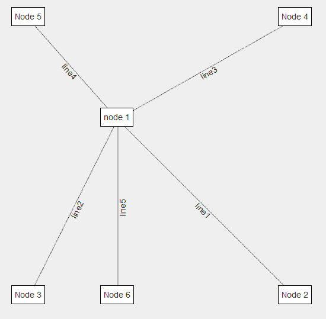

jquery/js-graph
===============

this package helps to visualize a graph with html elements



Installation
------------

download the js and the css file:
[javascript](dist/js/jsGraph.min.js)
[css](dist/css/jsGraph.min.css)

Usage
-----

templates:
```html
<script type="text/html" id="template">
    <div class="graph-node" data-template-bind='[{"attribute": "id", "value": "id"}]' data-content="name">
    </div>
</script>
<script type="text/html" id="line">
    <div class="graph-edge" data-template-bind='[{"attribute": "id", "value": "id"}]'>
        <div data-content="line"></div>
    </div>
</script>
```

html:

```html
<div id="myGraph" class="graph">
</div>
```

javascript:

```js
graph = $('#myGraph').jsGraph();
node1 = graph.addNode('#template', {id: 'node1', name: 'node 1'});
node2 = graph.addNode('#template', {id: 'node2', name: 'node 2'});

graph.addEdge('#line', node1, node2, {line: 'line1'});
```